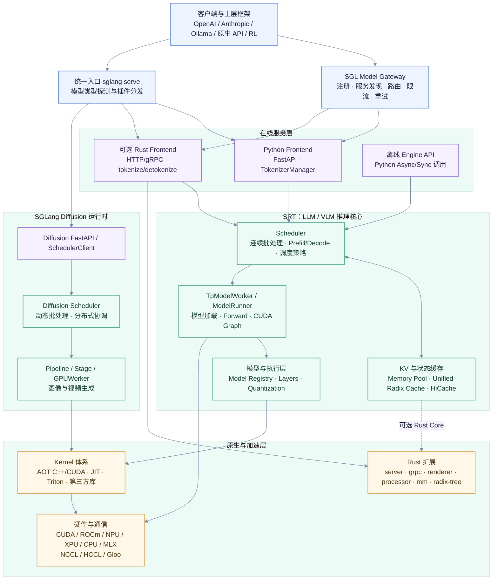
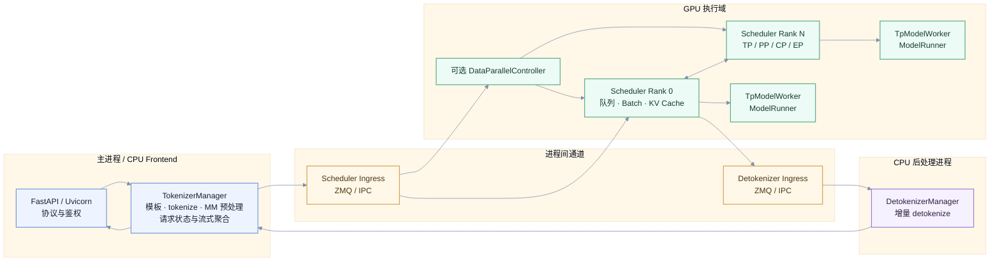
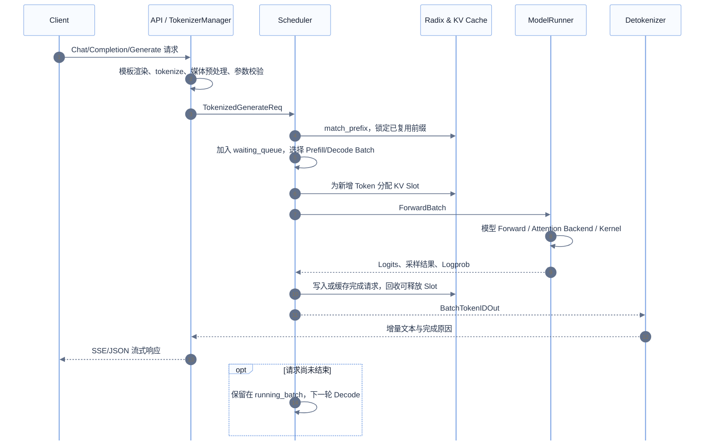
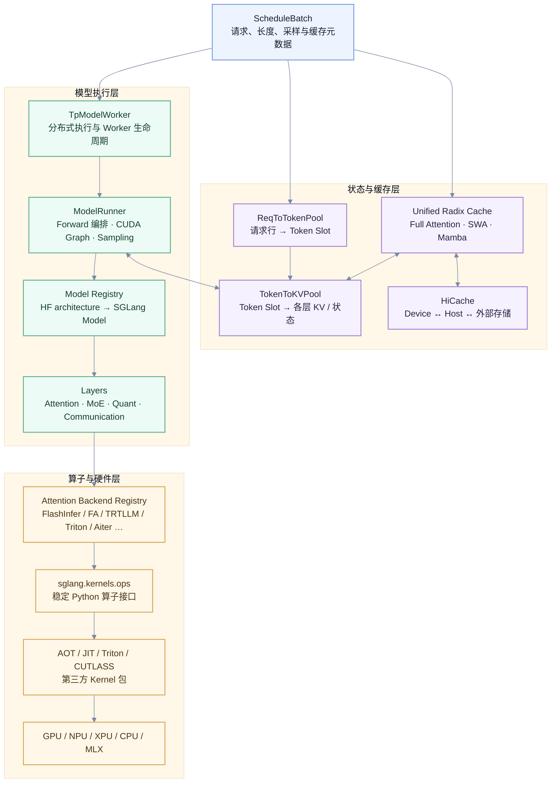

# SGLang 项目架构设计

> 本文基于 `main` 分支提交 `482b062d282b2ef4e449bd108df5228d81da2112`（`[Feature] serve pplx-decider decision checkpoints on /v1/systemone (#42183)`）整理，代码与 `origin/main` 已于 2026-10-03 核对一致。

## 1. 架构定位

SGLang 已经不是单一的 LLM HTTP Server，而是一套以高性能推理运行时为核心的服务栈：

- **SRT（SGLang Runtime）**负责语言模型、视觉语言模型、Embedding、Rerank 等模型的请求调度、内存管理与设备执行。
- **SGLang Diffusion**使用独立的调度器和 Pipeline 运行时，负责图像、视频及相关多模态生成。
- **SGL Model Gateway**位于集群入口，负责多实例、多模型以及 Prefill/Decode 分离部署的注册、发现、路由、限流与容错。
- **Python、Rust、CUDA/C++/Triton 等多语言组件**按控制面、数据面与算子热点拆分：Python 保留模型生态和调度灵活性，Rust 承担可选的高吞吐前端、协议处理与部分 CPU 热点，GPU Kernel 层承载计算热点。

项目最重要的设计思路可以概括为：**用稳定的请求/批次/缓存抽象隔离上层协议和下层设备实现，再通过多进程并行、连续批处理、前缀复用、分层缓存与可插拔 Kernel 把吞吐推到硬件边界。**

## 2. 全局架构

这里有两个容易混淆的边界：

1. `sgl-model-gateway/` 是面向一组后端实例的独立 Rust 网关，不在单个 SRT Scheduler 的进程内。
2. `python/sglang/multimodal_gen/` 的 Diffusion Scheduler 与 `python/sglang/srt/managers/scheduler.py` 是两套运行时；它们共享统一 CLI、部分基础设施和 Kernel，但不共享同一套批次状态机。

## 3. 仓库分层与职责

| 区域 | 主要职责 | 关键入口 |
| --- | --- | --- |
| `python/sglang/cli/` | `sglang serve/generate/version`；识别 LLM、Diffusion 或外部插件后端 | `cli/main.py`、`cli/serve.py` |
| `python/sglang/srt/entrypoints/` | HTTP、OpenAI/Anthropic/Ollama、原生 gRPC、离线 Engine 等入口 | `http_server.py`、`engine.py`、`grpc_server.py` |
| `python/sglang/srt/managers/` | Tokenize、Detokenize、调度、DP 控制、请求与批次生命周期 | `tokenizer_manager.py`、`scheduler.py`、`tp_worker.py` |
| `python/sglang/srt/model_executor/` | 模型加载后的执行编排、ForwardBatch、CUDA Graph 与后端选择 | `model_runner.py`、`forward_batch_info.py` |
| `python/sglang/srt/mem_cache/` | 请求到 Token 的映射、KV Pool、Radix 前缀树、HiCache 和外部存储 | `memory_pool.py`、`kv_cache_builder.py`、`unified_cache/` |
| `python/sglang/srt/models/` | SGLang 原生模型实现及按 HF architecture 动态注册 | `registry.py` |
| `python/sglang/srt/layers/` | Attention、MoE、量化、通信、RoPE 等可复用执行层 | `attention/attention_registry.py` |
| `python/sglang/kernels/` | 统一算子 API，以及 AOT、JIT、Triton/CUTLASS 等实现 | `ops/`、`aot/`、`jit/` |
| `python/sglang/multimodal_gen/` | Diffusion 的 API、Scheduler、Pipeline、模型加载和分布式执行 | `runtime/launch_server.py`、`runtime/pipelines_core/` |
| `python/sglang/lang/` | 结构化生成 DSL、IR、解释器与多种远端 Backend | `api.py`、`ir.py`、`interpreter.py` |
| `rust/` | 内嵌 Rust Server、gRPC、Tokenizer/Renderer、MM 预处理、Radix Tree 扩展 | `rust/Cargo.toml` |
| `proto/` | SGLang 原生 RPC、OpenAI 兼容 RPC 和管理 RPC 的统一协议 | `proto/sglang/runtime/v1/sglang.proto` |
| `sgl-model-gateway/` | 多 Worker 控制面与数据面、路由策略、PD 编排和可靠性机制 | `src/server.rs`、`src/routers/`、`src/policies/` |
| `benchmark/`、`test/`、`docs/` | 性能评测、CI/回归测试与文档站点 | 各目录入口 |

## 4. LLM/VLM 在线服务的进程模型

标准 `sglang serve` 路径采用“CPU 前后处理与 GPU 调度解耦”的多进程设计。默认情况下，主进程运行 FastAPI 和 `TokenizerManager`；每个 TP×PP Rank 对应一个 Scheduler 子进程；输出由独立 `DetokenizerManager` 处理。DP 大于 1 时，父进程先启动 `DataParallelController`，再由其管理各 DP Replica 的 Scheduler 组。

### 4.1 启动顺序

1. `sglang.cli.serve` 解析 `--model-type`，自动识别 LLM 或 Diffusion，也允许 setuptools entry point 注册外部 Serving Backend。
2. LLM 路径构造并一次性解析 `ServerArgs`，将其发布为带角色和 Rank 信息的 `RuntimeContext`。
3. `Engine._launch_subprocesses` 分配 IPC 端口，启动 Scheduler 或 DP Controller，并等待所有 Rank 完成模型、通信组和缓存初始化。
4. 默认 Python 前端再启动 Detokenizer 进程，并在主进程初始化 TokenizerManager；多 Tokenizer/Detokenizer 模式会增加 Router 进程。
5. HTTP Server 执行 Warmup，之后把健康状态切换为可服务。

`RuntimeContext` 是当前配置架构的关键：原始 `ServerArgs` 经解析后发布为按领域拆分的只读配置视图，例如 model、parallel、schedule、memory、serving、speculative、observability。每个派生进程带上自己的 role、world rank、DP rank 和 GPU id，从而减少“全局可变 ServerArgs 在不同进程含义不一致”的问题。

### 4.2 可选 Rust Frontend

设置 `SGLANG_RUST_SERVER=1` 后，Rank 0 Scheduler 进程内嵌 `rust/sglang-server`：HTTP/gRPC、Tokenizer、Detokenizer、SSE 和部分多模态预处理由 Rust 线程处理，通过进程内 Ring Buffer 与 Python Scheduler 交换请求和结果。此模式不再启动 Python TokenizerManager 与 Detokenizer 子进程。

Rust Frontend 是可选加速路径，当前默认值仍为关闭；离线 `sgl.Engine` 也明确不支持该模式。独立的原生 gRPC 监听器可通过 gRPC 配置与默认 HTTP Server 并存，不等同于旧的 SMG gRPC 服务路径。

## 5. 一次生成请求如何流动

请求生命周期包含以下核心状态：

- **协议对象**：OpenAI、Anthropic、Ollama 或原生请求先转换成统一的 `GenerateReqInput` / `EmbeddingReqInput`。
- **Tokenized Request**：TokenizerManager 生成 `TokenizedGenerateReqInput`，并为请求维护 `ReqState`、流式队列和取消状态。
- **Scheduler Req**：Scheduler 将输入转成 `Req`，进入 waiting queue；已执行请求位于 running batch，Prefill 与 Decode 可在连续批处理中交替。
- **ScheduleBatch / ForwardBatch**：`ScheduleBatch` 管理调度和缓存元数据，随后转换为面向设备执行的 `ForwardBatch`。
- **输出回路**：Scheduler 处理采样、停止条件、推测解码验证和缓存提交；Detokenizer 增量解码，TokenizerManager 合并元信息并向协议层流式返回。

Scheduler 支持普通循环与 overlap 循环。Overlap 模式把前一批结果的 CPU 处理与后一批 GPU Forward 重叠，并通过独立 Stream、Event 和 WAR 屏障保护共享缓冲区。调度策略还可组合 chunked prefill、优先级、LoRA 亲和性、grammar 约束、speculative decoding、beam search 等能力。

## 6. 缓存、模型执行与 Kernel 分层

### 6.1 两级地址映射

`ReqToTokenPool` 为每个活跃请求分配一行，记录其逻辑 Token 序列对应的物理 Slot；`TokenToKVPool` 再把这些 Slot 映射到每层 Attention KV、SWA 状态或 Mamba 状态。这样 Scheduler 可以移动、复用或回收请求，而模型层只读取批次准备好的索引。

### 6.2 Unified Radix Cache

Radix Cache 用 Token 前缀作为键，在不同请求之间复用已经计算过的 KV。当前 Unified Cache 把 Full Attention、Sliding Window Attention 和 Mamba/线性注意力状态纳入统一树结构，并统一处理匹配、插入、锁定、淘汰和 Session 语义。

树控制逻辑提供 Python 与 Rust Core 接口。受支持的平台和组件组合优先使用 `rust/sglang-radix-tree` 的 PyO3 实现，特殊配置或不支持的平台回退到 Python；缓存编排和设备/主机数据搬运仍由 Python 管理。

### 6.3 HiCache

开启分层缓存后，KV 可从设备显存扩展到 Host 内存及外部存储。Cache Controller 负责异步备份、加载、确认和淘汰，外部 Backend 位于 `mem_cache/storage/`，包括 NIXL、Mooncake、LMCache、FlexKV、UMB 等适配层。Unified Cache 负责“哪些前缀可复用”，Cache Controller 负责“这些状态位于哪一层以及如何搬运”。

### 6.4 模型与算子解耦

模型配置中的 Hugging Face `architectures` 经 `ModelRegistry` 解析到 `python/sglang/srt/models/` 的实现。模型只依赖 SGLang Layer 抽象；Attention Backend Registry 再根据模型、硬件、dtype 和启动参数选择 FlashInfer、FlashAttention、TensorRT-LLM、Triton、Aiter、Torch Native 等后端。

`python/sglang/kernels/ops/` 是稳定调用面，底下可以连接：

- `python/sglang/kernels/aot/`：重量级 C++/CUDA/HIP 编译扩展；
- `python/sglang/kernels/jit/`：按需构建和缓存的轻量扩展；
- Triton、CUTLASS DSL、FlashInfer、FlashAttention、DeepGEMM、DeepEP 等实现；
- 针对 CUDA、ROCm、NPU、XPU、MUSA、CPU、MLX 等平台的专用路径。

这层解耦使模型结构、调度策略和算子实现可以分别演进。

## 7. 并行与分布式设计

SGLang 的 Rank 拓扑并非只有 Tensor Parallel：

| 维度 | 作用 | 主要承载组件 |
| --- | --- | --- |
| TP | 切分模型张量与算子 | Scheduler Rank、TpModelWorker、通信层 |
| PP | 按层切分 Pipeline Stage | Scheduler PP Mixin、批次跨 Stage 传递 |
| DP | 复制模型实例并分发请求 | DataParallelController 或 Gateway |
| EP | 将 MoE Expert 分布到设备 | MoE Layer、DeepEP、EPLB、Elastic EP |
| Attention DP / CP / DCP | 拆分 Attention 或上下文并扩展长序列 | Parallel State、Attention Backend、KV 布局 |

每个 Scheduler 进程既是一个调度参与者，也是对应 Rank 的设备执行宿主。`runtime_context.SpawnRanks` 在子进程发布阶段固定 world/DP/GPU 身份，`distributed.bootstrap` 再建立设备与 CPU 通信组。跨节点时，非 0 节点只启动本地 Scheduler/Worker；服务入口与请求协调仍由 Rank 0 节点承担。

### Prefill/Decode 分离

PD Disaggregation 把高吞吐 Prefill 与低延迟 Decode 部署为不同 Worker 池：Gateway 为请求选择 Prefill 和 Decode Worker，Prefill 计算 KV 后通过 Mooncake、NIXL、MORI、Ascend 等传输后端交给 Decode。Scheduler 通过 Prefill/Decode Mixin 管理预分配、传输队列、Bootstrap 元数据、失败清理和可选的角色切换。

这种设计把“流量路由”“KV 传输”和“单实例内的批处理”分成三个层次：Gateway 决定请求去哪，Disaggregation 层决定 KV 怎么到达，Scheduler 决定本设备下一批执行什么。

## 8. SGL Model Gateway

`sgl-model-gateway/` 是 Tokio/Axum 风格的独立 Rust 服务，内部同时包含控制面和数据面：

- **控制面**：Worker 注册、能力发现、健康检查、Service Discovery、后台 Job Queue、Worker Registry。
- **数据面**：HTTP/gRPC/OpenAI Backend 路由、流式代理、PD 请求编排、多模型 Router Manager。
- **路由策略**：random、round-robin、cache-aware、power-of-two、bucket、consistent hashing、prefix hash 等。
- **可靠性**：请求级重试、指数退避、Circuit Breaker、Token Bucket、排队和健康状态隔离。
- **可观测性**：Prometheus、OpenTelemetry、结构化日志和请求级追踪。

Gateway 可以对普通 Worker 池做负载均衡，也可以管理 Prefill/Decode 两类 Worker；gRPC 路径还可在网关侧完成 Tokenize、Reasoning Parser 和 Tool Parser，从而减少 Python Frontend 压力。

## 9. SGLang Diffusion

CLI 发现 Diffusion 模型后会转入 `python/sglang/multimodal_gen/runtime/`。它采用独立的进程和批处理模型：

1. `launch_server` 以 `spawn` 方式为本节点每张 GPU 启动 Scheduler/Worker 进程。
2. Rank 0 Scheduler 通过 ZMQ ROUTER 接收 `SchedulerClient` 请求，并将请求广播到所属 DP Replica。
3. `BatchAdmissionController` 将兼容请求组成动态批次；Scheduler 负责队列、Warmup、LoRA、后训练权重更新和 Disaggregation 控制。
4. `GPUWorker` 根据 Pipeline 配置加载模型组件，由 `pipelines_core` 中的 Stage/Executor 执行文本编码、Denoise、Decode、后处理等阶段。
5. 分布式层组合 TP、SP、CFG Parallel 与 DP；Disaggregation 模式还能把 Encoder、Denoiser、Decoder 拆到不同 GPU 池。

它与 SRT 共享“前端/调度/Worker/Kernel 分层”和可观测性思想，但请求对象、批处理规则、模型 Pipeline 和显存模型都独立实现。

## 10. 多模态输入处理

LLM/VLM 路径中的多模态处理发生在 Tokenizer/Processor 与 Scheduler 两侧：前端负责解析媒体、模板和 Processor，Scheduler Rank 负责把媒体特征与 Token 布局对齐并广播到并行 Rank。大张量可通过共享内存或专用传输对象跨进程，避免塞进普通消息体。

Rust Frontend 为支持的模型族提供全 Rust 媒体流水线：抓取/解码 → resize/normalize/patchify → Token Layout → 位置编码。`rust/sglang-mm` 同时构建为 PyO3 扩展和供 `sglang-server` 链接的纯 Rust Library，使 Python 与 Rust 路径能够共用处理语义。

## 11. 可观测性与运维控制

可观测性不是旁路脚本，而是贯穿请求状态机：

- HTTP、Tokenizer、Scheduler、ModelRunner、Cache 和 Gateway 都有指标或追踪埋点；
- Scheduler 统计队列、Prefill/Decode、KV 使用、Batch 与阶段耗时；
- OpenTelemetry Trace Context 可随请求跨进程传播；
- Prometheus 暴露 Server、Scheduler 和 Gateway 指标；
- Watchdog、父进程信号、Rank 共识检查和健康接口共同处理子进程异常；
- 管理 API 支持 Profile、动态日志、Pause/Continue、缓存清理、LoRA 加载、权重热更新和显存休眠/恢复。

## 12. 扩展点

项目通过 Registry、Plugin 和接口层控制扩展成本：

| 扩展目标 | 机制 |
| --- | --- |
| 新模型 | 在 `srt/models` 提供 `EntryClass`，由 `ModelRegistry` 按 architecture 发现 |
| 新 Attention Backend | `register_attention_backend` 注册构造器 |
| 新硬件平台 | `sglang.srt.platforms` entry point + Platform Interface |
| 新服务模型类型 | `sglang.serve_backends` entry point |
| 新通用插件 | `sglang.srt.plugins` entry point，通过 Hook Registry 注入函数或替换类 |
| 新 Cache Tree Core | 实现 `UnifiedTreeCoreInterface` 并注册 Backend |
| 新 HiCache 存储 | 在 `mem_cache/storage` 实现连接器/Linker |
| 新 Kernel | 稳定 `sglang.kernels.ops` API 下接 JIT 或 AOT 实现 |
| 新 Diffusion Pipeline | Pipeline Config + Stage/Executor + Loader Registry |
| 新 Gateway 路由策略 | 实现 Policy 并加入 `policies/registry.rs` |

## 13. 关键设计取舍

### 多进程隔离与 IPC 成本

Tokenizer、Scheduler 和 Detokenizer 分进程可以隔离 GIL、CPU 抖动、设备上下文和故障，但增加序列化与 IPC 成本。项目通过 ZMQ、共享内存、批量消息和可选 Rust 进程内前端降低这一成本。

### 动态能力与启动复杂度

模型、硬件、量化、Attention、Kernel 与并行组合非常多，因此启动阶段承担了大量探测、约束解析、Registry 选择和 Warmup。对应收益是稳态事件循环可以使用已经冻结的 RuntimeContext 和已选择的 Backend，减少热路径分支。

### 缓存收益与一致性成本

Radix Prefix Cache、HiCache、PD KV Transfer 和 Session Cache 都依赖精确的引用计数、锁、淘汰与传输确认。SGLang 把树语义、物理 Pool 和 I/O Controller 分开，使每层有明确职责，但跨层变更必须同时验证请求生命周期和异常清理。

### 通用性与专用优化

上层保持统一的 Scheduler、ModelRunner 和 Layer 协议，下层允许针对模型与硬件选择专用实现。这避免用单一 Kernel 覆盖所有模型，也意味着性能问题通常需要沿“调度 → 缓存布局 → Attention Backend → Kernel”完整定位。

## 14. 推荐的源码阅读顺序

1. [`python/sglang/cli/serve.py`](../python/sglang/cli/serve.py)：理解统一入口和 LLM/Diffusion 分流。
2. [`python/sglang/srt/entrypoints/engine.py`](../python/sglang/srt/entrypoints/engine.py)：理解进程拓扑、启动握手和生命周期。
3. [`python/sglang/srt/managers/tokenizer_manager.py`](../python/sglang/srt/managers/tokenizer_manager.py)：理解请求前处理与流式状态。
4. [`python/sglang/srt/managers/scheduler.py`](../python/sglang/srt/managers/scheduler.py)：理解核心事件循环和批处理状态机。
5. [`python/sglang/srt/managers/schedule_batch.py`](../python/sglang/srt/managers/schedule_batch.py)：理解 `Req`、`ScheduleBatch` 与 KV 元数据。
6. [`python/sglang/srt/managers/tp_worker.py`](../python/sglang/srt/managers/tp_worker.py) 与 [`python/sglang/srt/model_executor/model_runner.py`](../python/sglang/srt/model_executor/model_runner.py)：理解设备执行。
7. [`python/sglang/srt/mem_cache/kv_cache_builder.py`](../python/sglang/srt/mem_cache/kv_cache_builder.py) 与 [`python/sglang/srt/mem_cache/unified_cache/`](../python/sglang/srt/mem_cache/unified_cache/)：理解缓存体系。
8. [`python/sglang/srt/runtime_context.py`](../python/sglang/srt/runtime_context.py)：理解配置发布和进程角色。
9. [`rust/sglang-server/src/lib.rs`](../rust/sglang-server/src/lib.rs)：理解可选 Rust Frontend 的 Python/Rust 边界。
10. [`sgl-model-gateway/src/`](../sgl-model-gateway/src/) 与 [`python/sglang/multimodal_gen/runtime/`](../python/sglang/multimodal_gen/runtime/)：分别扩展到集群路由和 Diffusion 运行时。
